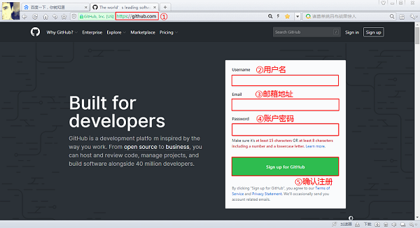
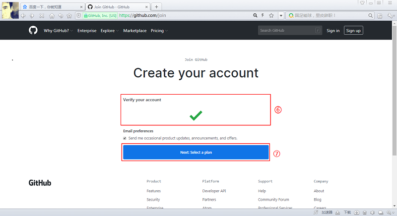
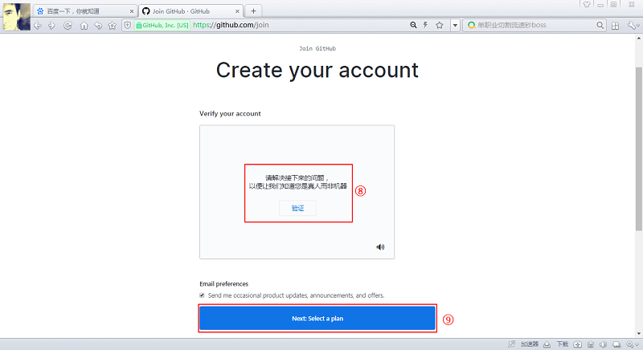
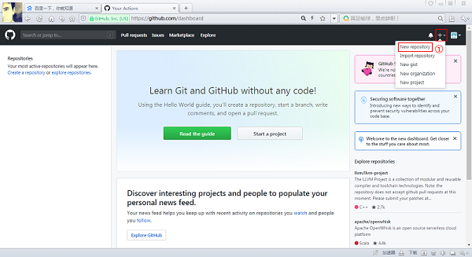
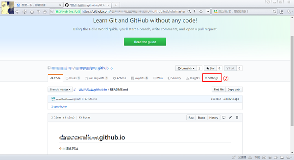
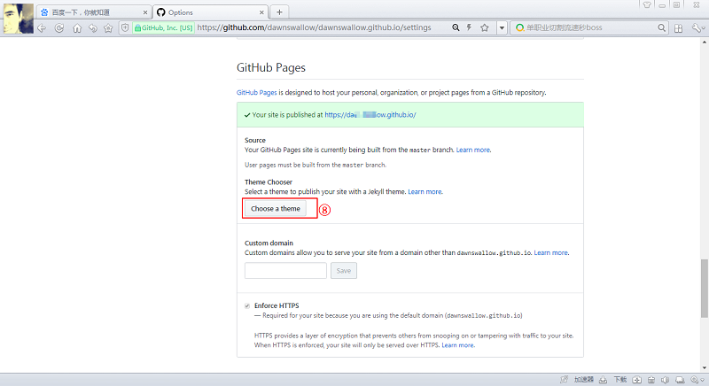
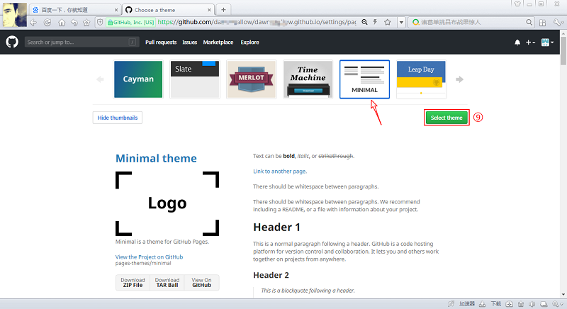

# 如何利用 GitHub 建立个人博客网站

## 开始之前：

> 1. 这个教程适合电脑初级使用者、对 GitHub 了解甚少者；
> 2. 这个教程建立的个人网站还只是一个初级版本，不过也是一个够用的完整版；
> 3. 如果你也相信 ***完成比完美更重要*** ，那么完成下面的步骤，你会有所收获！

接下来我们就通过 GitHub Page 的功能建立一个属于自己的个人博客网站。

## 注册 GitHub 账号

首先我们需要在 [github.com](https://github.com) 网站上申请一个个人账号。

① 用浏览器输入GitHub 的官网： `https://github.com` 

② 输入用户名 `Username` ，**注意：用户名只能包含字母、数字字符或单个连字符，且不能以连字符开头或结尾**。

③-④ 输入邮箱地址 `Email` 、账户密码 `Password` 

⑤ 点击 *确认注册* 按钮 `Sign up for Github` 

⑥-⑦ 这儿网站会核实一下你创建的账号的有效性，确认没有问题通过了，点击下一步`Next: Select a plan` 

⑧⑨ 有时候还会验证一下你是真人而非机器，完成相应问题，继续点击下一步`Next: Select a plan` 

⑩ 让你选择一个计划，这儿我们选择 *个人* `Individuals`，并点击 *选择免费版 *`Choose Free` 

紧接着转到个性化引导选项的 页面，这儿我们把网页拉到最底端，选择 *完成注册* 按钮 ：`Complete Signup` 。至此，完成注册。

## 创建专属仓库

① 完成注册并登陆成功后，页面如下所示，点击右上角的 `+` 并选择`New repository`

② 填写仓库名 `Repository name` ，***注意：这个仓库名一定是：你自己的`用户名`加后缀`.github.io`***

③ 填写仓库简介 `Description` ，这儿可以简单描述一下，后续可以随时修改，也可以选择不填

④ 选择仓库属性，这里默认选择*公开*  `Public`

⑤ 选择选项: *用一个 README 文件初始化这个仓库*  `Initialize this repository with a README`

⑥ 确认 *创建仓库*  ，点击`Create repository` 按钮

⑦ 紧接着选择 *设置*  `Settings`

⑧ 转到新的页面往下滑到 `GitHub Pages` 的位置，选择 `Choose a theme`  

⑨ 选择一个自己喜欢的网站主题，这儿我们选择 `Minimal` 主题，点击 `Select theme`

紧接着会把你这个仓库的 README.md 文档进行初始化，其内容后续会以进行不断修改、优化，所以先不用管它，页面拉到最低端，选择确认创建即可。

## 登录专属博客网站

到这儿你的个人博客网站的雏形就已经创建好了，只需要登录 `https://username.github,io` 即可查看**（注意：这儿的 'username'是你的 GitHub 账户名**）。

