# 如何利用 GitHub 建立个人博客网站

## 开始之前：

> 1. 这个教程适合电脑初级使用者、对 GitHub 了解甚少者；
> 2. 这个教程建立的个人网站还只是一个初级版本，不过也是一个够用的完整版；
> 3. 如果你也相信 ***完成比完美更重要*** ，那么完成下面的步骤，你会有所收获！

接下来我们就通过 GitHub Page 的功能建立一个属于自己的个人博客网站。

## 注册 GitHub 账号

首先我们需要在 [github.com](https://github.com) 网站上申请一个个人账号。

① 用浏览器输入GitHub 的官网： `https://github.com` 

② 输入用户名 `Username` ，**注意：用户名只能包含字母、数字字符或单个连字符，且不能以连字符开头或结尾**。

③-④ 输入邮箱地址 `Email` 、账户密码 `Password` 

⑤ 点击 *确认注册* 按钮 `Sign up for Github` 

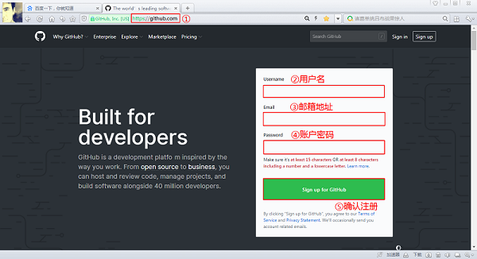

⑥-⑦ 这儿网站会核实一下你创建的账号的有效性，确认没有问题通过了，点击下一步`Next: Select a plan` 

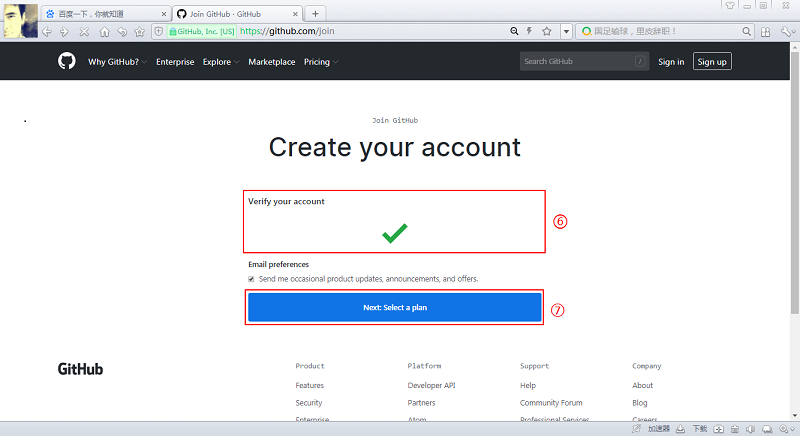

⑧⑨ 有时候还会验证一下你是真人而非机器，完成相应问题，继续点击下一步`Next: Select a plan` 

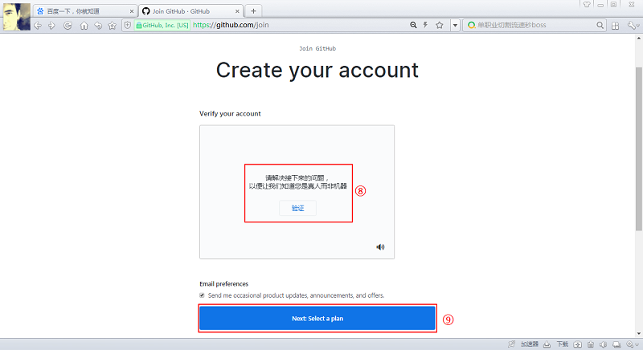

⑩ 让你选择一个计划，这儿我们选择 *个人* `Individuals`，并点击 *选择免费版 *`Choose Free` 

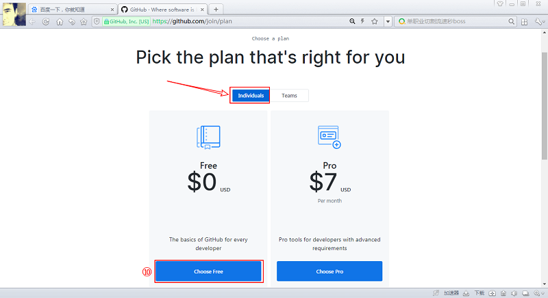

紧接着转到个性化引导选项的 页面，这儿我们把网页拉到最底端，选择 *完成注册* 按钮 ：`Complete Signup` 。至此，完成注册。


## 创建专属仓库

① 完成注册并登陆成功后，页面如下所示，点击右上角的 `+` 并选择`New repository`

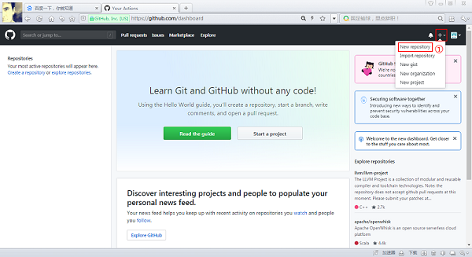

② 填写仓库名 `Repository name` ，***注意：这个仓库名一定是：你自己的`用户名`加后缀`.github.io`***

③ 填写仓库简介 `Description` ，这儿可以简单描述一下，后续可以随时修改，也可以选择不填

④ 选择仓库属性，这里默认选择*公开*  `Public`

⑤ 选择选项: *用一个 README 文件初始化这个仓库*  `Initialize this repository with a README`

⑥ 确认 *创建仓库*  ，点击`Create repository` 按钮

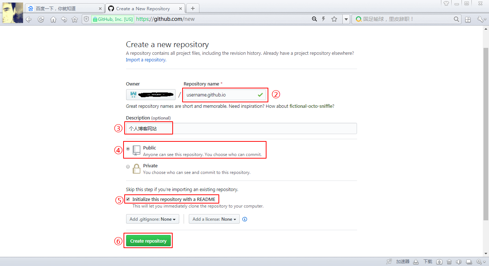

⑦ 紧接着选择 *设置*  `Settings`

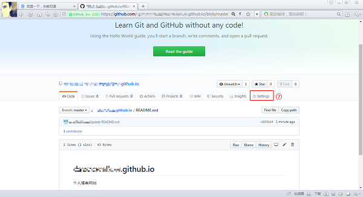

⑧ 转到新的页面往下滑到 `GitHub Pages` 的位置，选择 `Choose a theme`  

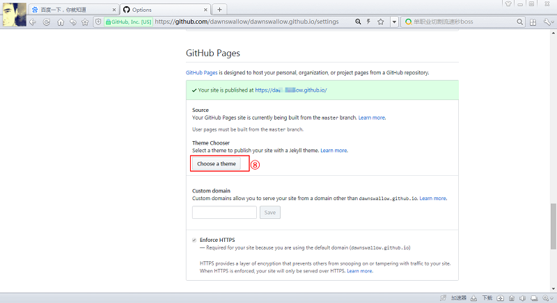

⑨ 选择一个自己喜欢的网站主题，这儿我们选择 `Minimal` 主题，点击 `Select theme`

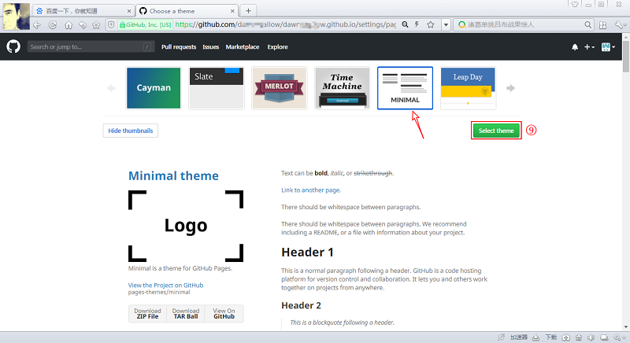

⑩ 之后会把你这个仓库的 README.md 文档进行初始化，其内容后续会以进行不断修改、优化，所以先不用管它，页面拉到最低端，选择 *提交修改* `Commit changes` 即可

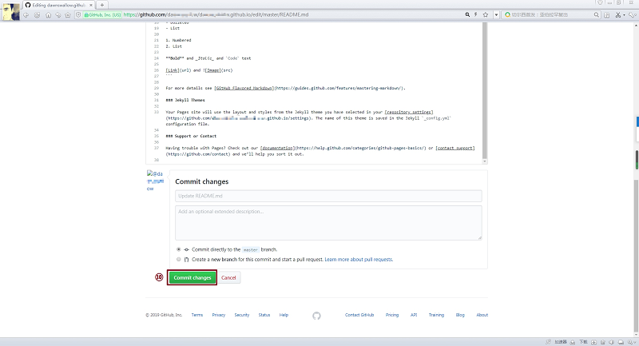

## 登录专属博客网站

好了，完成以上操作，到这儿你的个人博客网站的雏形就已经创建好了，只需要在浏览器打开一个新的标签页，输入网址 `https://username.github.io` 即可查看 **（注意：这儿的 `username` 要替换成你的 GitHub 账户名）**。

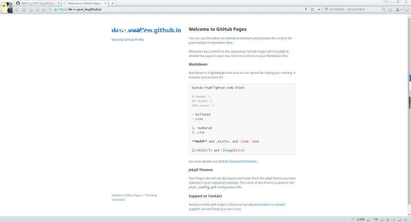

## 自定义主页

博客网站的主页内容，其实就是这个专属仓库的 `README.md` 文档内容，那么我们只需要修改这个文档的内容，就可以更新博客主页的内容了。

① 首先，我们打开这个专属仓库，默认显示的就是 `README.md` 文档的内容，我们点击右上角 *铅笔* 形状的按钮，进入编辑页面

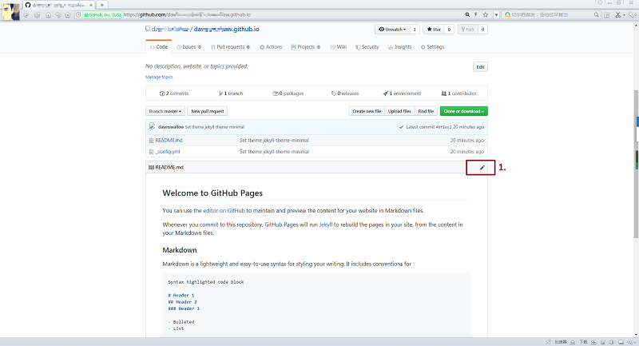

②-③ 然后，修改 `README.md` 文档的内容，这儿我修改成下面这段文字仅供参考。修改好之后，点击 *提交修改* `Commit changes` ，

```markdown
# 我的个人博客

欢迎来到我的个人博客网站！

## 名言警句

“古之欲明明德于天下者，先治其国；欲治其国者，先齐其家；欲齐其家者，先修其身；欲修其身者，先正其心；欲正其心者，先诚其意；欲诚其意者，先致其知，致知在格物。物格而后知至，知至而后意诚，意诚而后心正，心正而后身修，身修而后家齐，家齐而后国治，国治而后天下平。”——《礼记·大学》

## 区块链入门

1. 最友好的区块链入门小书
2. 获取你人生的第一笔比特币
```

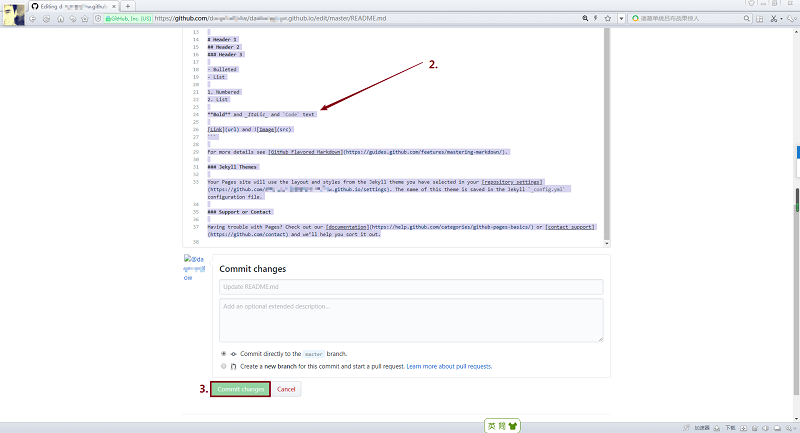

③ 回到博客网站，刷新一下（有时候需要稍等片刻，服务器同步信息，可以多刷新几下），我们可以看到，主页的内容更新了


## 丰富主页内容

① 新建 `docs` 和 `images` 文件夹

② 上传 *我的文档* 至 `docs` 文件夹 以及 *我的图片* 至 `images` 文件夹

③ 更新主页的 README.md 文档


