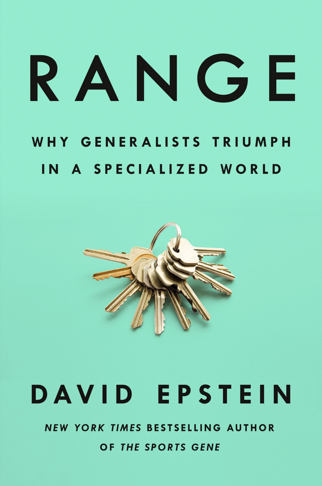
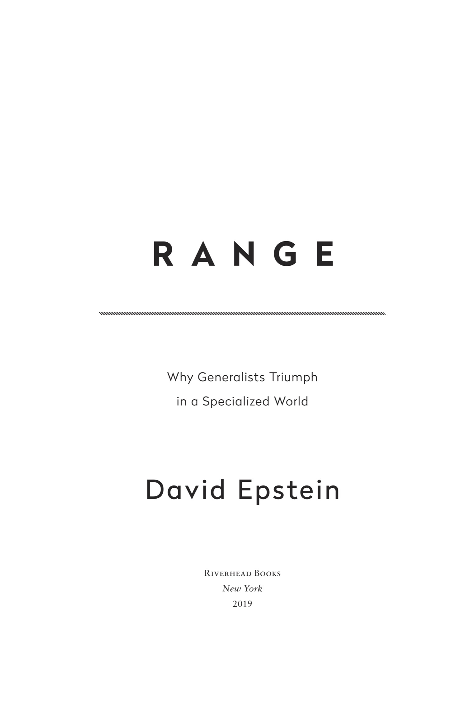
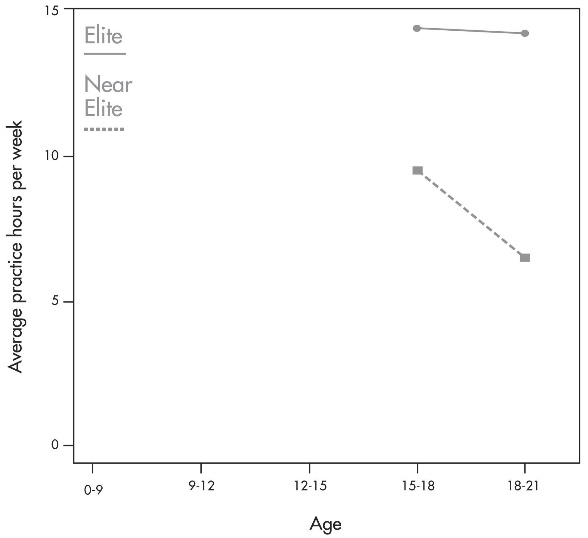
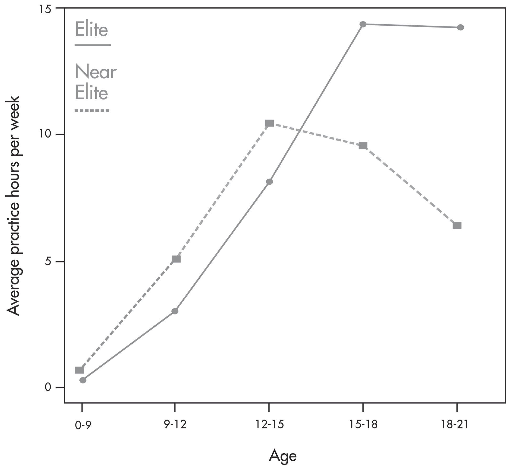

# RANGE 

主标题：范围

Why Generalists Triumph in a Specialized World 

副标题：在这个专业化的世界里为什么通才获的了胜利

By David Epstein

作者：大卫·爱普斯坦

---

## Cover Page 封面页

## Title Page 标题页

---

## Epigraph 铭文

And he refused to specialize in anything, preferring to keep an eye on *the overall estate* rather than any of its parts. . . . And Nikolay’s management produced the most brilliant results.

—Leo Tolstoy, *War and Peace*

他拒绝专攻任何事情，宁愿关注整个庄园，而不是它的任何一部分。。。。 尼古拉的管理产生了最辉煌的结果。

——利奥·托尔斯泰，战争与和平

No tool is omnicompetent. There is no such thing as a master-key that will unlock *all* doors.

—Arnold Toynbee, *A Study of History*

没有哪个工具是全能的。没有什么东西，如一把万能钥匙，可以打开所有的门。

——阿诺德·汤因比，历史研究

---

## Contents

INTRODUCTION: Roger vs. Tiger

CHAPTER 1: The Cult of the Head Start

CHAPTER 2: How the Wicked World Was Made

CHAPTER 3: When Less of the Same Is More

CHAPTER 4: Learning, Fast and Slow

CHAPTER 5: Thinking Outside Experience

CHAPTER 6: The Trouble with Too Much Grit

CHAPTER 7: Flirting with Your Possible Selves

CHAPTER 8: The Outsider Advantage 

CHAPTER 9: Lateral Thinking with Withered Technology

CHAPTER 10: Fooled by Expertise

CHAPTER 11: Learning to Drop Your Familiar Tools

CHAPTER 12: Deliberate Amateurs

CONCLUSION: Expanding Your Range

## 目录

引    言：罗杰 VS. 老虎

第 1 章：头脑的狂热崇拜开始了

第 2 章：邪恶的世界是如何建立的

第 3 章：当不太一样的情况更多时

第 4 章：学习，快与慢 

第 5 章：思考外部经验 

第 6 章：过度坚毅带来的问题

第 7 章：与你可能的自我调情

第 8 章：冷门选手优势

第 9 章：枯萎技术的横向思维

第10章：被专业知识愚弄 

第11章：学会放下你熟悉的工具 

第12章：刻意的业余爱好者

结    论：扩大你的范围 

---

## INTRODUCTION: Roger vs. Tiger

LET’S START WITH a couple of stories from the world of sports. This first one, you probably know.

让我们从体育界的几个故事开始。 第一个，你可能知道。

The boy’s father could tell something was different. At six months old, the boy could balance on his father’s palm as he walked through their home. At seven months, his father gave him a putter to fool around with, and the boy dragged it everywhere he went in his little circular baby walker. At ten months, he climbed down from his high chair, trundled over to a golf club that had been cut down to size for him, and imitated the swing he’d been watching in the garage. Because the father couldn’t yet talk with his son, he drew pictures to show the boy how to place his hands on the club. “It is very difficult to communicate how to putt when the child is too young to talk,” he would later note.

男孩的父亲可以看出有什么不同之处。 六个月大的时候，男孩就可以在他父亲的手掌上保持平衡，穿梭于他们家的房子。 七个月大之后，他父亲给了他一个推杆来闲耍，男孩拖着它，借着他的小圆形婴儿学步车，到处走。 在十个月大的时候，他从高高的椅子上爬下来，慢慢走到一个被裁短成适合他个头的高尔夫球棒，在车库里模仿着他看到的挥棒动作。 因为父亲还不能和他的儿子说话，他画了一些画来告诉男孩如何把他的手放在球棒上。 “当孩子太小而不能说话时，很难沟通如何把球轻轻打进洞里，”父亲后来回忆说。

At two—an age when the Centers for Disease Control and Prevention list physical developmental milestones like “kicks a ball” and “stands on tiptoe”—he went on national television and used a club tall enough to reach his shoulder to drive a ball past an admiring Bob Hope. That same year, he entered his first tournament, and won the ten-and-under division.

There was no time to waste. By three, the boy was learning how to play out of a “sand twap,” and his father was mapping out his destiny. He knew his son had been chosen for this, and that it was his duty to guide him. Think about it: if you felt that certain about the path ahead, maybe you too would start prepping your three-year-old to handle the inevitable and insatiable media that would come. He quizzed the boy, playing reporter, teaching him how to give curt answers, never to offer more than precisely what was asked. That year, the boy shot 48, eleven over par, for nine holes at a course in California.

When the boy was four, his father could drop him off at a golf course at nine in the morning and pick him up eight hours later, sometimes with the money he’d won from those foolish enough to doubt.

At eight, the son beat his father for the first time. The father didn’t mind, because he was convinced that his boy was singularly talented, and that he was uniquely equipped to help him. He had been an outstanding athlete himself, and against enormous odds. He played baseball in college when he was the only black player in the entire conference. He understood people, and discipline; a sociology major, he served in Vietnam as a member of the Army’s elite Green Berets, and later taught psychological warfare to future officers. He knew he hadn’t done his best with three kids from a previous marriage, but now he could see that he’d been given a second chance to do the right thing with number four. And it was all going according to plan.

The boy was already famous by the time he reached Stanford, and soon his father opened up about his importance. His son would have a larger impact than Nelson Mandela, than Gandhi, than Buddha, he insisted. “He has a larger forum than any of them,” he said. “He’s the bridge between the East and the West. There is no limit because he has the guidance. I don’t know yet exactly what form this will take. But he is the Chosen One.”

---

This second story, you also probably know. You might not recognize it at first.

第二个故事，你可能也知道。 一开始你可能看不出来。

His mom was a coach, but she never coached him. He would kick a ball around with her when he learned to walk. As a boy, he played squash with his father on Sundays. He dabbled in skiing, wrestling, swimming, and skateboarding. He played basketball, handball, tennis, table tennis, badminton over his neighbor’s fence, and soccer at school. He would later give credit to the wide range of sports he played for helping him develop his athleticism and hand-eye coordination.

男孩的妈妈是个教练，但她妈妈从来没有训练过他。当他学会走路时，他会和她一起踢球。作为一个男孩，他在星期天和他父亲打壁球。他涉足滑雪、摔跤、游泳和滑板。 他打篮球、手球、网球、乒乓球、在邻居的篱笆上打羽毛球，在学校踢足球。 他后来称赞，他所做的广泛的运动，帮助他发展他的运动能力和手眼协调。

He found that the sport really didn’t matter much, so long as it included a ball. “I was always very much more interested if a ball was involved,” he would remember. He was a kid who loved to play. His parents had no particular athletic aspirations for him. “We had no plan A, no plan B,” his mother would later say. She and the boy’s father encouraged him to sample a wide array of sports. In fact, it was essential. The boy “became unbearable,” his mother said, if he had to stay still for too long.

Though his mother taught tennis, she decided against working with him. “He would have just upset me anyway,” she said. “He tried out every strange stroke and certainly never returned a ball normally. That is simply no fun for a mother.” Rather than pushy, a *Sports Illustrated* writer would observe that his parents were, if anything, “pully.” Nearing his teens, the boy began to gravitate more toward tennis, and “if they nudged him at all, it was to stop taking tennis so seriously.” When he played matches, his mother often wandered away to chat with friends. His father had only one rule: “Just don’t cheat.” He didn’t, and he started getting really good.

As a teenager, he was good enough to warrant an interview with the local newspaper. His mother was appalled to read that, when asked what he would buy with a hypothetical first paycheck from playing tennis, her son answered, “a Mercedes.” She was relieved when the reporter let her listen to a recording of the interview and they realized there’d been a mistake: the boy had said “*Mehr CDs*,” in Swiss German. He simply wanted “more CDs.”

The boy was competitive, no doubt. But when his tennis instructors decided to move him up to a group with older players, he asked to move back so he could stay with his friends. After all, part of the fun was hanging around after his lessons to gab about music, or pro wrestling, or soccer.

By the time he finally gave up other sports—soccer, most notably—to focus on tennis, other kids had long since been working with strength coaches, sports psychologists, and nutritionists. But it didn’t seem to hamper his development in the long run. In his midthirties, an age by which even legendary tennis players are typically retired, he would still be ranked number one in the world.

---

In 2006, Tiger Woods and Roger Federer met for the first time, when both were at the apex of their powers. Tiger flew in on his private jet to watch the final of the U.S. Open. It made Federer especially nervous, but he still won, for the third year in a row. Woods joined him in the locker room for a champagne celebration. They connected as only they could. “I’ve never spoken with anybody who was so familiar with the feeling of being invincible,” Federer would later describe it. They quickly became friends, as well as focal points of a debate over who was the most dominant athlete in the world.

在2006年，老虎伍兹和罗杰·费德勒第一次见面，当时两人都处于能力的顶峰。老虎乘着私人飞机来到现场，观看美国公开赛的决赛。这让费德勒特别紧张，但他仍然连续第三年获胜。伍兹和他在更衣室里一起香槟庆祝。 他们尽可能地联系起来。 “我从来没有和任何一个如此熟悉无敌感的人交谈过，”费德勒后来会这样描述。 他们很快成为了朋友，也成为了关于谁是世界上最具支配地位的运动员的辩论的焦点。

Still, the contrast was not lost on Federer. “His story is completely different from mine,” he told a biographer in 2006. “Even as a kid his goal was to break the record for winning the most majors. I was just dreaming of just once meeting Boris Becker or being able to play at Wimbledon some time.”

不过，与费德勒的对比并没有消失。 “他的故事和我的完全不同，”他在2006年对一位传记作家说。 “即使在他小时候，他的目标也是打破赢得最多专业冠军的纪录。 我只是梦想有一次能见到鲍里斯·贝克尔或者有一段时间能在温布尔登打球。” 

It seems pretty unusual for a child with “pully” parents, and who first took his sport lightly, to grow into a man who dominates it like no one before him. Unlike Tiger, thousands of kids, at least, had a head start on Roger. Tiger’s incredible upbringing has been at the heart of a batch of bestselling books on the development of expertise, one of which was a parenting manual written by Tiger’s father, Earl. Tiger was not merely playing golf. He was engaging in “deliberate practice,” the only kind that counts in the now-ubiquitous ten-thousand-hours rule to expertise. 

对于一个拥有像“普莉”一样、一开始对孩子的运动并不上心的父母的孩子来说，成长为一个前无古人般主宰运动的人，这是非常不寻常的。 不像老虎，至少有成千上万的孩子，起步在罗杰之上。 老虎令人难以置信的教养一直是一批关于专业技能发展的畅销书的核心要素，其中就有一本老虎的父亲Earl写的育儿手册。 老虎不仅仅是打高尔夫。 他一直在参与“刻意练习”，唯一一种运用目前广泛熟知的一万小时规则培养专业技能的有价值做法。

The “rule” represents the idea that the number of accumulated hours of highly specialized training is the sole factor in skill development, no matter the domain. Deliberate practice, according to the study of thirty violinists that spawned the rule, occurs when learners are “given explicit instructions about the best method,” individually supervised by an instructor, supplied with “immediate informative feedback and knowledge of the results of their performance,” and “repeatedly perform the same or similar tasks.” Reams of work on expertise development shows that elite athletes spend more time in highly technical, deliberate practice each week than those who plateau at lower levels:

“规则”代表了这样一种观点，即无论在哪个领域，高度专业化培训的累积时数都是技能培养的唯一因素。 这一规则由对30名小提琴家的研究得来，根据这一研究，刻意练习发生在学习者“得到关于最佳方法的明确指示”时，由一名教师单独监督，提供“对他们表现结果的即时信息反馈和理解”，以及“反复执行相同或类似的任务”。大量关于专业技能培养的研究成果表明，精英运动员每周花在强技术性的、刻意的练习上比那些在较低水平进入停滞期的人多：

Tiger has come to symbolize the idea that the quantity of deliberate practice determines success—and its corollary, that the practice must start as early as possible.

老虎·伍兹就是这一观点的象征性代表，即刻意练习的数量决定成功——以及它的必然结果，也即练习必须尽早开始。

The push to focus early and narrowly extends well beyond sports. We are often taught that the more competitive and complicated the world gets, the more specialized we all must become (and the earlier we must start) to navigate it. Our best-known icons of success are elevated for their precocity and their head starts—Mozart at the keyboard, Facebook CEO Mark Zuckerberg at the other kind of keyboard. The response, in every field, to a ballooning library of human knowledge and an interconnected world has been to exalt increasingly narrow focus. Oncologists no longer specialize in cancer, but rather in cancer related to a single organ, and the trend advances each year. Surgeon and writer Atul Gawande pointed out that when doctors joke about left ear surgeons, “we have to check to be sure they don’t exist.”

早期小范围的焦点追逐，不断延展，远远超出了体育界。我们经常被教导，世界越是充满竞争性和复杂性，我们就必须都变得越专业（我们就必须越早开始），才能驾驭它。 最为人所知的成功标志在他们的早熟期就被发掘，于是他们的领先即已开始——对于莫扎特是琴键，而对于Facebook首席执行官马克·扎克伯格则是键盘。 在每个领域，对一个不断膨胀的人类知识图书馆和一个相互关联的世界的反应都是在不断加强狭隘的焦点。肿瘤学家不再专门研究癌症，而是研究与单个器官相关的癌症，这种趋势每年都在发展。 身为外科医生和作家的阿图尔·加万德指出，当医生开玩笑说是左耳外科医生时，“我们必须核实一下，以确保他们不存在。”

In the ten-thousand-hours-themed bestseller *Bounce*, British journalist Matthew Syed suggested that the British government was failing for a lack of following the Tiger Woods path of unwavering specialization. Moving high-ranking government officials between departments, he wrote, “is no less absurd than rotating Tiger Woods from golf to baseball to football to hockey.”

在以一万小时为主题的畅销书《反弹》（*Bounce*）中，英国记者马修·塞德(MatthewSyed)指出，英国政府失败了是因为未能遵循老虎·伍兹的坚定不移专业化道路。 他写道，在部门之间调动高级政府官员，“就像让老虎·伍兹从打高尔夫转而打棒球，再到足球、曲棍球一样荒谬。”

Except that Great Britain’s massive success at recent Summer Olympics, after decades of middling performances, was bolstered by programs set up specifically to recruit adults to try new sports and to create a pipeline for late developers—“slow bakers,” as one of the officials behind the program described them to me. Apparently the idea of an athlete, even one who wants to become elite, following a Roger path and trying different sports is not so absurd. Elite athletes at the peak of their abilities do spend more time on focused, deliberate practice than their near-elite peers. But when scientists examine the entire developmental path of athletes, from early childhood, it looks like this:

除了英国在最近的夏季奥运会上取得的巨大成功，在经历了几十年的中等表现之后，还得到了一些项目的支持，这些项目专门招募成年人尝试新的体育项目，并为已故开发商创造了一条管道-“慢面包师”，正如该项目背后的一位官员向我描述的那样。 显然，一个运动员的想法，即使是一个想成为精英的人，遵循罗杰的道路，尝试不同的运动也不是那么荒谬。 精英运动员在他们能力的巅峰，确实花更多的时间集中，深思熟虑的练习比他们的近精英同龄人。 但是，当科学家从幼儿开始研究运动员的整个发展道路时，它看起来是这样的：

Eventual elites typically devote *less* time early on to deliberate practice in the activity in which they will eventually become experts. Instead, they undergo what researchers call a “sampling period.” They play a variety of sports, usually in an unstructured or lightly structured environment; they gain a range of physical proficiencies from which they can draw; they learn about their own abilities and proclivities; and only later do they focus in and ramp up technical practice in one area. The title of one study of athletes in individual sports proclaimed “Late Specialization” as “the Key to Success”; another, “Making It to the Top in Team Sports: Start Later, Intensify, and Be Determined.”

When I began to write about these studies, I was met with thoughtful criticism, but also denial. “Maybe in some other sport,” fans often said, “but that’s not true of *our* sport.” The community of the world’s most popular sport, soccer, was the loudest. And then, as if on cue, in late 2014 a team of German scientists published a study showing that members of their national team, which had just won the World Cup, were typically late specializers who didn’t play more organized soccer than amateur-league players until age twenty-two or later. They spent more of their childhood and adolescence playing nonorganized soccer and other sports. Another soccer study published two years later matched players for skill at age eleven and tracked them for two years. Those who participated in more sports and nonorganized soccer, “but not more organized soccer practice/training,” improved more by age thirteen. Findings like these have now been echoed in a huge array of sports, from hockey to volleyball.

The professed necessity of hyperspecialization forms the core of a vast, successful, and sometimes well-meaning marketing machine, in sports and beyond. In reality, the Roger path to sports stardom is far more prevalent than the Tiger path, but those athletes’ stories are much more quietly told, if they are told at all. Some of their names you know, but their backgrounds you probably don’t.

I started writing this introduction right after the 2018 Super Bowl, in which a quarterback who had been drafted into professional baseball before football (Tom Brady), faced off against one who participated in football, basketball, baseball, and karate and had chosen between college basketball and football (Nick Foles). Later that very same month, Czech athlete Ester Ledecká became the first woman ever to win gold in two different sports (skiing and snowboarding) at the same Winter Olympics. When she was younger, Ledecká participated in multiple sports (she still plays beach volleyball and windsurfs), focused on school, and never rushed to be number one in teenage competition categories. The *Washington Post* article the day after her second gold proclaimed, “In an era of sports specialization, Ledecká has been an evangelist for maintaining variety.” Just after her feat, Ukrainian boxer Vasyl Lomachenko set a record for the fewest fights needed to win world titles in three different weight classes. Lomachenko, who took four years off boxing as a kid to learn traditional Ukrainian dance, reflected, “I was doing so many different sports as a young boy—gymnastics, basketball, football, tennis—and I think, ultimately, everything came together with all those different kinds of sports to enhance my footwork.”

Prominent sports scientist Ross Tucker summed up research in the field simply: “We know that early sampling is key, as is diversity.”

---

In 2014, I included some of the findings about late specialization in sports in the afterword of my first book, *The Sports Gene*. The following year, I got an invitation to talk about that research from an unlikely audience—not athletes or coaches, but military veterans. In preparation, I perused scientific journals for work on specialization and career-swerving outside of the sports world. I was struck by what I found. One study showed that early career specializers jumped out to an earnings lead after college, but that later specializers made up for the head start by finding work that better fit their skills and personalities. I found a raft of studies that showed how technological inventors increased their creative impact by accumulating experience in different domains, compared to peers who drilled more deeply into one; they actually benefited by proactively sacrificing a modicum of depth for breadth as their careers progressed. There was a nearly identical finding in a study of artistic creators.

I also began to realize that some of the people whose work I deeply admired from afar—from Duke Ellington (who shunned music lessons to focus on drawing and baseball as a kid) to Maryam Mirzakhani (who dreamed of becoming a novelist and instead became the first woman to win math’s most famous prize, the Fields Medal)—seemed to have more Roger than Tiger in their development stories. I delved further and encountered remarkable individuals who succeeded not in spite of their range of experiences and interests, but because of it: a CEO who took her first job around the time her peers were getting ready to retire; an artist who cycled through five careers before he discovered his vocation and changed the world; an inventor who stuck to a self-made antispecialization philosophy and turned a small company founded in the nineteenth century into one of the most widely resonant names in the world today.

I had only dipped my toe into research on specialization in the wider world of work, so in my talk to the small group of military veterans I mostly stuck to sports. I touched on the other findings only briefly, but the audience seized on it. All were late specializers or career changers, and as they filed up one after another to introduce themselves after the talk, I could tell that all were at least moderately concerned, and some were borderline ashamed of it.

They had been brought together by the Pat Tillman Foundation, which, in the spirit of the late NFL player who left a professional football career to become an Army Ranger, provides scholarships to veterans, active-duty military, and military spouses who are undergoing career changes or going back to school. They were all scholarship recipients, former paratroopers and translators who were becoming teachers, scientists, engineers, and entrepreneurs. They brimmed with enthusiasm, but rippled with an undercurrent of fear. Their LinkedIn profiles didn’t show the linear progression toward a particular career they had been told employers wanted. They were anxious starting grad school alongside younger (sometimes much younger) students, or changing lanes later than their peers, all because they had been busy accumulating inimitable life and leadership experiences. Somehow, a unique advantage had morphed in their heads into a liability.

A few days after I spoke to the Tillman Foundation group, a former Navy SEAL who came up after the talk emailed me: “We are all transitioning from one career to another. Several of us got together after you had left and discussed how relieved we were to have heard you speak.” I was slightly bemused to find that a former Navy SEAL with an undergraduate degree in history and geophysics pursuing graduate degrees in business and public administration from Dartmouth and Harvard needed me to affirm his life choices. But like the others in the room, he had been told, both implicitly and explicitly, that changing directions was dangerous.

The talk was greeted with so much enthusiasm that the foundation invited me to give a keynote speech at the annual conference in 2016, and then to small group gatherings in different cities. Before each occasion, I read more studies and spoke with more researchers and found more evidence that it takes time—and often forgoing a head start—to develop personal and professional range, but it is worth it.

I dove into work showing that highly credentialed experts can become so narrow-minded that they actually get worse with experience, even while becoming more confident—a dangerous combination. And I was stunned when cognitive psychologists I spoke with led me to an enormous and too often ignored body of work demonstrating that learning itself is best done slowly to accumulate lasting knowledge, even when that means performing poorly on tests of immediate progress. That is, the most effective learning looks inefficient; it looks like falling behind.

Starting something new in middle age might look that way too. Mark Zuckerberg famously noted that “young people are just smarter.” And yet a tech founder who is fifty years old is nearly twice as likely to start a blockbuster company as one who is thirty, and the thirty-year-old has a better shot than a twenty-year-old. Researchers at Northwestern, MIT, and the U.S. Census Bureau studied new tech companies and showed that among the fastest-growing start-ups, the average age of a founder was forty-five when the company was launched.

Zuckerberg was twenty-two when he said that. It was in his interest to broadcast that message, just as it is in the interest of people who run youth sports leagues to claim that year-round devotion to one activity is necessary for success, never mind evidence to the contrary. But the drive to specialize goes beyond that. It infects not just individuals, but entire systems, as each specialized group sees a smaller and smaller part of a large puzzle.

One revelation in the aftermath of the 2008 global financial crisis was the degree of segregation within big banks. Legions of specialized groups optimizing risk for their own tiny pieces of the big picture created a catastrophic whole. To make matters worse, responses to the crisis betrayed a dizzying degree of specialization-induced perversity. A federal program launched in 2009 incentivized banks to lower monthly mortgage payments for homeowners who were struggling but still able to make partial payments. A nice idea, but here’s how it worked out in practice: a bank arm that specialized in mortgage lending started the homeowner on lower payments; an arm of the same bank that specialized in foreclosures then noticed that the homeowner was suddenly paying less, declared them in default, and seized the home. “No one imagined silos like that inside banks,” a government adviser said later. Overspecialization can lead to collective tragedy even when every individual separately takes the most reasonable course of action.

Highly specialized health care professionals have developed their own versions of the “if all you have is a hammer, everything looks like a nail” problem. Interventional cardiologists have gotten so used to treating chest pain with stents—metal tubes that pry open blood vessels—that they do so reflexively even in cases where voluminous research has proven that they are inappropriate or dangerous. A recent study found that cardiac patients were actually less likely to die if they were admitted during a national cardiology meeting, when thousands of cardiologists were away; the researchers suggested it could be because common treatments of dubious effect were less likely to be performed.

An internationally renowned scientist (whom you will meet toward the end of this book) told me that increasing specialization has created a “system of parallel trenches” in the quest for innovation. Everyone is digging deeper into their own trench and rarely standing up to look in the next trench over, even though the solution to their problem happens to reside there. The scientist is taking it upon himself to attempt to despecialize the training of future researchers; he hopes that eventually it will spread to training in every field. He profited immensely from cultivating range in his own life, even as he was pushed to specialize. And now he is broadening his purview again, designing a training program in an attempt to give others a chance to deviate from the Tiger path. “This may be the most important thing I will ever do in my life,” he told me.

I hope this book helps you understand why.

---

When the Tillman Scholars spoke of feeling unmoored, and worried they were making a mistake, I understood better than I let on. I was working on a scientific research vessel in the Pacific Ocean after college when I decided for sure that I wanted to be a writer, not a scientist. I never expected that my path from science into writing would go through work as the overnight crime reporter at a New York City tabloid, nor that I would shortly thereafter be a senior writer at *Sports Illustrated,* a job that, to my own surprise, I would soon leave. I began worrying that I was a job-commitment-phobic drifter who must be doing this whole career thing wrong. Learning about the advantages of breadth and delayed specialization has changed the way I see myself and the world. The research pertains to every stage of life, from the development of children in math, music, and sports, to students fresh out of college trying to find their way, to midcareer professionals in need of a change and would-be retirees looking for a new vocation after moving on from their previous one.

The challenge we all face is how to maintain the benefits of breadth, diverse experience, interdisciplinary thinking, and delayed concentration in a world that increasingly incentivizes, even demands, hyperspecialization. While it is undoubtedly true that there are areas that require individuals with Tiger’s precocity and clarity of purpose, as complexity increases—as technology spins the world into vaster webs of interconnected systems in which each individual only sees a small part—we also need more Rogers: people who start broad and embrace diverse experiences and perspectives while they progress. People with range.

我们都面临的挑战是，如何在一个越来越充满激励、甚至要求、超专业化的世界中，坚持广泛、多样化经验、跨学科思维和延迟专业化的好处。 毫无疑问，确实有一些领域需要像老虎·伍兹般的早熟的和有明确目的人，但是，随着复杂性的增加——随着技术将世界带到相互连接的系统的巨大网络中，每个人只看到一小部分——我们也需要更多像罗杰一样的人：当他们进步时，他们广泛开始，拥抱不同的经验和观点。他们是 涉猎广泛的人。
